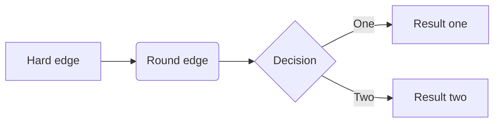

# AhaAlgorithm
AhaAlgorithm Java


1. 表格

+ 苹果

+ 西瓜

  | 水果 | 颜色 |
  | ---- | ---- |
  | 西瓜 | 红色 |

  

  

2. <https://blog.csdn.net/WeiDelight/article/details/81011921>

3. [typora教程](<https://blog.csdn.net/WeiDelight/article/details/81011921>)

4. 代码块

```python
def test():
	print("test success")
```

5. 横向flowchart

```flow
st=>start: 开始框
op=>operation: 处理框
cond=>condition: 判断框(是或否?)
sub1=>subroutine: 子流程
io=>inputoutput: 输入输出框
e=>end: 结束框
st->op->cond
cond(yes)->io->e
cond(no)->sub1(right)->op
```

6. FlowChart




